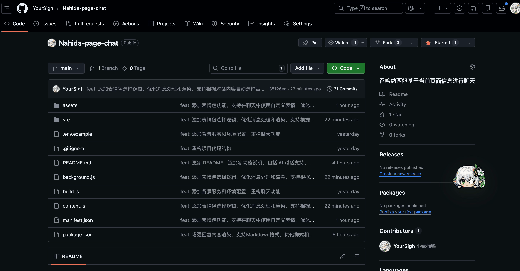

# Nahida page chat

一个纳西妲基于当前页面信息进行聊天的浏览器插件

功能：

- 打开任意网页后自动注入一个悬浮图标
- 悬浮图标支持鼠标拖动
- 拖动后会记住位置，下次打开网页继续沿用
- 点击悬浮图标可打开对话框
- 对话框支持拖动（拖拽标题栏）与调整大小（边缘/四角拖拽缩放）
- 对话框弹出位置会锚定在悬浮图标附近，并在超出页面时自动向内收敛
- 对话框显示时悬浮图标会自动隐藏，关闭对话框后恢复显示
- 对话框支持背景图（`assets/background.jpeg`）
- 扩展栏图标也会使用你的图片
- 主 Logo 为 `assets/floating-icon.png`（见下方「图标资源」）
- 支持 AI 对话（OpenAI 兼容接口），回复支持 Markdown 渲染
- 支持 `<think>...</think>` 思考过程展示（可折叠，类似 DeepSeek）
- 内置网页智能体：优先使用 OpenAI 兼容的原生 Function Calling；不支持时自动回退到兼容模式
- 模型先读取页面状态，再使用临时 `targetId` 操作精确元素，不再猜 CSS selector
- 支持点击、输入、下拉选择、按键、滚动、等待等操作，并显示每一步的执行状态
- 设置面板中的“启用页面操作（全局）”开关默认关闭、切换后立即生效并保存在本地：关闭时插件仅读取页面内容，开启后可在所有可注入网页执行页面操作
- 点击会先返回执行确认、再触发 DOM 点击，避免页面跳转销毁通信通道后误报工具超时
- 读取工具会尽量合并 **iframe 内**可注入 frame 的正文/可见文本/query 结果（跨域但同扩展权限的页面一般可读；极少数沙箱 iframe 仍可能无法注入）

页面操作目前以主页面文档为目标；iframe 仍支持内容读取，但不会被自动点击或输入，避免把元素定位到错误 frame。

页面操作说明：

- `get_page_state`：读取可见文本与可操作元素，为当前页面建立临时目标 ID
- `click`：按临时目标 ID 点击一个元素
- `type`：填写 `input`、`textarea` 或 `contenteditable`，可清空或追加内容
- `select_option`：设置原生 `select` 的 value 或 label
- `press_key`：向目标元素派发键盘事件；部分网站会拒绝非真实用户事件
- `scroll`：滚动页面或指定滚动容器
- `wait`：等待页面异步更新

受浏览器安全限制，Chrome/Edge 内置页面、扩展管理页、部分 PDF 页面通常不能注入；跨域沙箱 iframe，以及依赖“真实用户手势”的网站行为也可能失败。页面跳转会结束当前页面的对话，新页面加载后可继续使用悬浮窗。插件会把实际结果交给模型，不会假装操作成功。

## Demo



- 视频文件：[`项目演示.mp4`](项目演示.mp4)

对话框关闭方式：

- 点击右上角“关闭”按钮
- 按 `Esc`

## 目录说明

- `manifest.json`: 插件配置
- `content.js`: content script（由 `src/` 打包产物）
- `background.js`: MV3 service worker（由 `src/` 打包产物，负责调用大模型 API / 工具调度）
- `src/content/index.js`: 悬浮图标 + 对话框 UI + 工具执行
- `src/page/pageController.js`: 页面状态快照、临时目标 ID 与 DOM 操作
- `src/background/nativeAgent.js`: 原生 Function Calling 智能体循环
- `src/background/index.js`: 服务工作线程、兼容模式与 iframe 读取
- `assets/floating-icon.png`: 主 Logo（你维护的源图，不会被脚本覆盖）
- `assets/floating-icon-cropped.png`: 由 `npm run icons` 从主图去边后生成，页面悬浮球优先使用

## 本地加载方式

1. 打开 Chrome 或 Edge
2. 进入扩展管理页
3. 打开“开发者模式”
4. 选择“加载已解压的扩展程序”
5. 选择当前目录

## 开发与构建

本项目使用 `esbuild` 将 `src/` 下的源码打包成根目录的 `content.js` / `background.js`（供 `manifest.json` 直接引用）。

### 环境变量（大模型配置）

请新建 `.env`（可参考 `.env.example`），填入你的模型参数：

- `LLM_API_BASE_URL`: OpenAI 兼容接口地址（例如 `https://api.openai.com/v1`）
- `LLM_API_KEY`: API Key
- `LLM_MODEL`: 模型名

- 构建一次：

```bash
npm install
npm run build
```

构建后请在扩展管理页点击“重新加载”，并刷新已打开的目标网页；content script 只会在页面加载时注入，单独执行构建不会更新已经打开的网页。

- 开发监听（修改后自动重新打包）：

```bash
npm run dev
```

## 图标资源（Logo）

1. 把你的主图放到 **`assets/floating-icon.png`**（建议带透明背景，方便自动去边）。
2. 生成扩展栏用 `icon-*.png` 和悬浮球用的 **`floating-icon-cropped.png`**（会按透明像素 **trim** 掉一圈空隙，再缩放进方框；**不会改写** 你的 `floating-icon.png`）：

```bash
npm install
npm run icons
```

3. `npm run build` 后，在 `chrome://extensions` **重新加载**扩展。

页面悬浮球：**优先** `floating-icon-cropped.png`，没有或加载失败则用 **`floating-icon.png`**。

若源图没有透明通道、四周颜色与主体接近，自动 trim 可能效果不大，需要在画图软件里把画布裁紧一点再导出。
